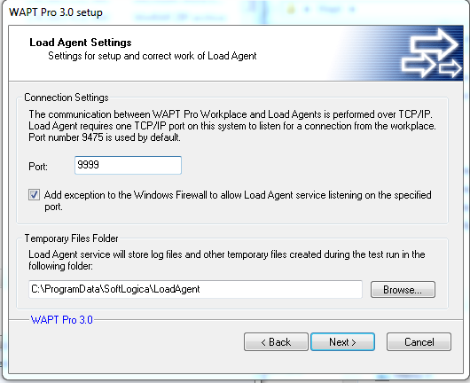
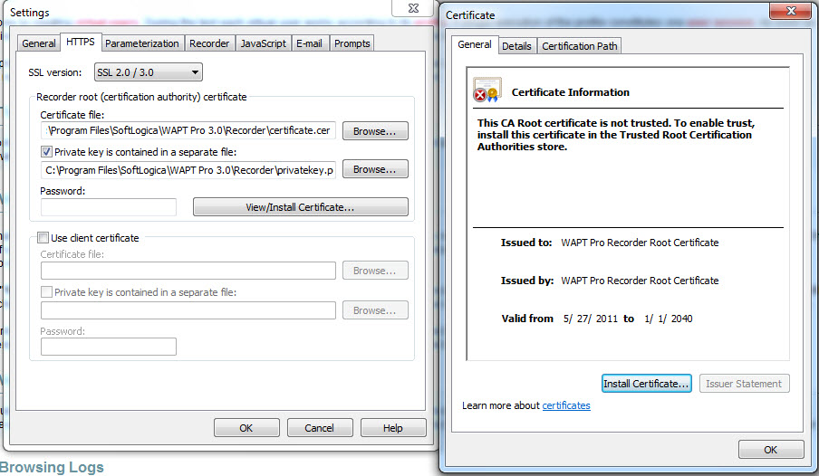
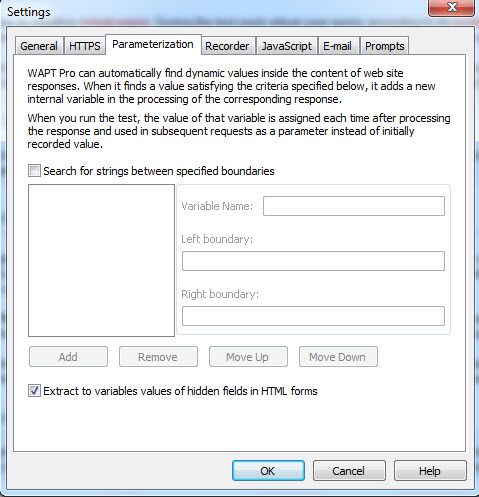
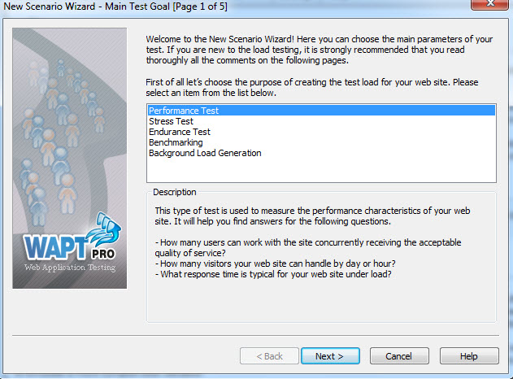
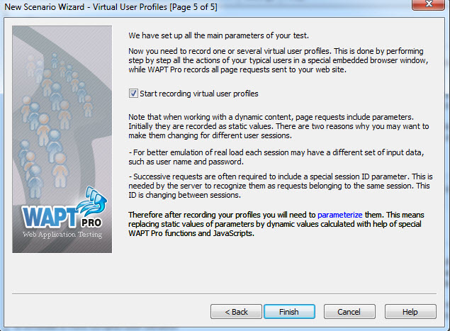
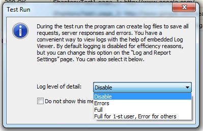
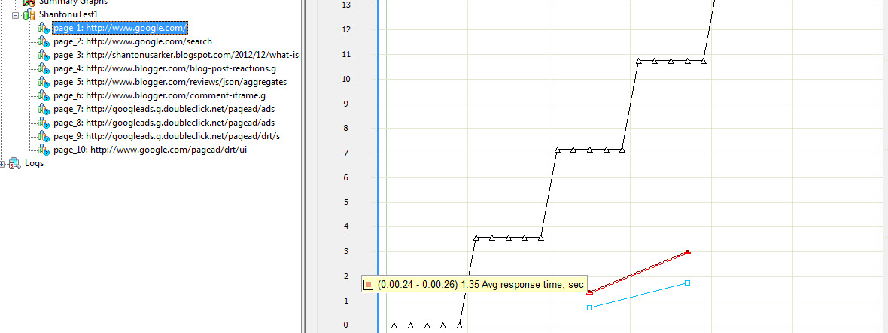
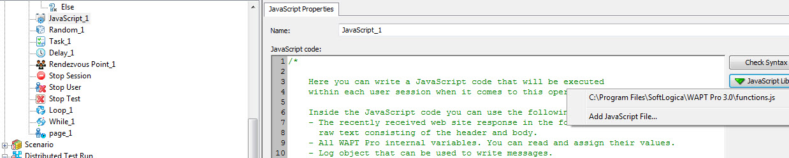
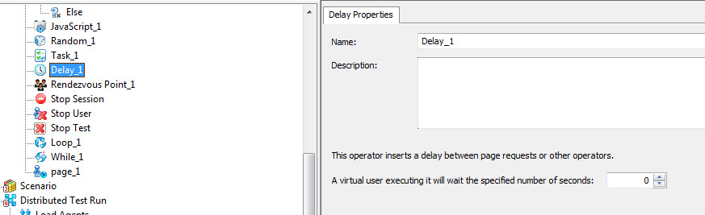

In this article, We are going to see how to use WAPTPro. This is an introductory learning for invoice testers like me. I hope it will help others also. I haven’t tried anything complex, just small concept of testing with an example. 

First see the requirement of PC and install from [here](http://www.loadtestingtool.com/download.shtml). I have user WAPTPro trial edition 

What is WAPT? WAPT is a tool for Performance Testing (load and stress testing) on a website (with load balancers, web servers, application servers, database storages, etc) in an easy manner. For more, see their [link](http://www.loadtestingtool.com/).

# Basic : WAPT follows
-One execution runs under one user session.
-A virtual user (VUser) may consist of several user sessions.
-A virtual user operates under several user profiles. Different profile simulates different type of user. 

-Load agents run Virtual Users. (A Load Agent is installed as a Windows service on your system during installation, we can configure that).

-We can run load agent manager(from start menu) to manage multiple agents.
 
- Load Agent installation

- LoadAgent

- LoadAgentManager

- LoadAgentManagerAccounts

- A scenario consist of Settings and Configurations (Test Volume, Log/report settings/Performance counters)

- A Test Volume may have multiple User Profiles.

There are three type of VUser generation can be done by WAPT

# Concept 
A. Constant type loads Fixed Number of users at same time. This is used in Background Load Generation.

B. Ramp-UP type increases Number of Users in defined time. This is used in Benchmarking, Stress testing, Performance testing . Ex- Increasing from 0 user to 30 user, with 3 user increment in every 5 seconds means , it will need 50 second to get total users.

C. Periodic type generates Constant load for a defined period of time. It has Two mode, Low phage and High Phage. This is used in Endurance Test. Ex- 50 User load(all at a time) for 1 min , then 100 user for 3 min.

# Type of tests
WAPTPro performs 5 types of tests. These are categorizing by their functionality and need. It may not meet standard definition. I am assuming we all know about those following type of test(you may google it). I am just defining by how they are functioning under WAPT.

1. Performance Test : WAPT defines the Performance Test by answering following questions. 
 - How many users can work with the site concurrently receiving the acceptable quality of service?
 - How many visitors your web site can handle by day or hour?
 - What response time is typical for your web site under load?

2. Stress Test: WAPT defines the Stress Test by answering following questions. 
- It should not crash or stop responding completely.
- The number of correct page responses per second should not decline significantly.
- It should either provide a user friendly overload message for the requests that it cannot serve, or delay all responses equally.
- After a period of overload it should return to the normal operation without performance degradation.

3. Endurance Test : This Type of test checks the ability of website to withstand the specified load for long period of time. In such conditions the performance degradation can be a result of memory leaks or other server resource allocation problem. The endurance testing is usually performed for several hours. The goal is to confirm that the web site performance during different test phases does not differ significantly.

4. Benchmarking : This is used for measuring benchmarking for different function to compare. If we to choose the best configuration, you can repeat same test and compare performance parameters.

5. Background Load Generation: We can create a typical background load and perform manual testing at the same time. This way you can check what real users will experience when working with your web site under load.

# WAPTPro UI :These are some screenshots. 

- Menu-1

- Menu 2

- Menu 3

- Menu 4

- Menu 5

- Menu 6

- Menu 7

- Settings 1

- Settings 2

- Settings 3

- Settings 4

- Settings 5

- Settings 6

- Settings 7

- Settings-AddCertificate

# An Example of performance test: 

(I am adding Screenshots of a sample Performance Test example)

1. Create Test Scenario: This Contains VUsers, Test Duration, settings.
I use performance test on google. 

- AddTest

- AddTestWithRempUp

- AddTestWithPeridodic

- AddTestSetLimit

- AddTestWithConstantUsers

- AddTestReportSettings

- AddTestWithRecording Confirmation

2. Create Virtual User Profile: We can record scenarios for VUsers.

RecordingBrowserOption

RecordingBrowserOptionParameterization

Recording-BrowserOptionSelection

Recording Message

3. Verify Test : Verify a test for a profile by running all tests with settings and parameters for one time only. Problems are shown in result Log. 

4. Run test / schedule test. 

5. See Results/Logs/Reports(after stopping )
 
A Result contains: 
- Error Rate: Percentage( %) of Error Requests/Completed Sessions .
- Response Time:  Correct reply time to single page request. For Total time, we need to include all. 
- Page/Sec : Number of pages requests successfully saved by site in one second.

We can save the report as HTML and open to see in details (Unzip [this](images/wapt/HTMLReports.rar) file and open Untitled.html and you can find my performed tests report). Some screenshots 

HTML Report in Browser

HTML Report in Browser1

Report

SummaryReportOptions

SummaryReport1

SummaryReport2

SummaryReport3

SummaryReport4

SummaryReport5

SummaryReport6

Log: To view log ,select the item from left. Some screenshots. 
LogTotal

Log1

Log2

Log3

- Now see profile.

Profile Properties

New ProfileScenario

Profile Options

AddOptionsAfterStop

Open Options

We can add following items(options) under a user profile: 
- JavaScript

- Loop Control (To execute its content repetitively)

- While Loop control(To execute its content repetitively with conditions)

- If then Else condition

- Condition box 1

- Condition box 2

- Rendezvous Point(either Active% users or number of users)

- Random Properties (To choose random requests from included properties and send request randomly) 

- Task(to join series of successive page requests)

- Delay(Inserts delay between pages)

- New Page 

 and 
 

- Stop Agent(End the test)

- Stop User(Stops current VUser)

- Stop session(stop current session and start the next one)

# Note : 
-We may need to Install WPST certificate if required.

- We can apply proxy or change other settings from here. 

-We can change Browser’s User Agent from profile’s properties 
![UserAgent]](images/wapt/UserAgent.jpg)

-The Rendevous Point instructs VUsers To wait till all VUsers come to a certain point and proceed together. When we are performing load testing we will make the scenario in such a way that all the processes hit the application at a single point of time so using rendezvous point it collects all process and throws on the application at a time. 

I tried WAPTPro for sometime Experimentally. I hope this will help others to use or even buy WAPT pro. Happy blogging.

….Thanks …:)