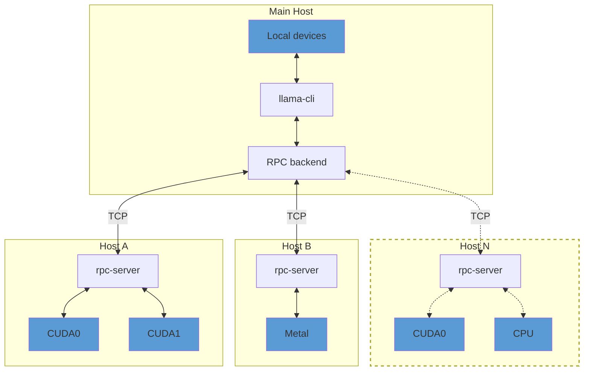

# This is Lama CPP Basics

# Lama CPP GUI 

# LamaCpp CLI commands 

# LamaCPP Architecture 

# LamaCPP installations : Ubuntu
- install dependencies
```shell 
sudo apt update && sudo apt install -y git build-essential cmake
```
- Download Latest [release from here](https://github.com/ggml-org/llama.cpp/releases)
- Make Exutable ```chmod +x llama-cli``` and check version ```./llama-cli --version```

### Tools Comes with Llama-cpp
- If you see ```ls``` in the folder, you may see these following tools 

[llama-debug-template-parser](tools/parser/debug-template-parser.cpp)  : Pase Dubug Logs 
llama-minicpmv-cli  
llama-results
llama                
llama-fit-params             
llama-mtmd-cli      
llama-server
llama-batched-bench  
llama-gemma3-cli             
llama-mtmd-debug    
llama-template-analysis
llama-bench : Benchmarking/Performance testing tool for llama.cpp        
llama-gguf-split             
llama-perplexity    
llama-tokenize
llama-cli : Main CLI Tools             
llama-imatrix                
llama-quantize      
llama-tts
[llama-completion](https://github.com/ggml-org/llama.cpp/blob/master/tools/completion/completion.cpp): To use various LLaMA language models easily and efficiently 
llama-llava-cli              
llama-qwen2vl-cli   
[rpc-server](https://github.com/ggml-org/llama.cpp/tree/master/tools/rpc) : The rpc-server allows exposing ggml(tensor library) devices on a remote host.




All tool source (todo): https://github.com/ggml-org/llama.cpp/tree/master/tools


### Build LLamaCPP from source 
```  
git clone https://github.com/ggml-org/llama.cpp.git
```

- Create and 
``` 
mkdir build
cd build

cmake ..
cmake --build . --config Release 
```